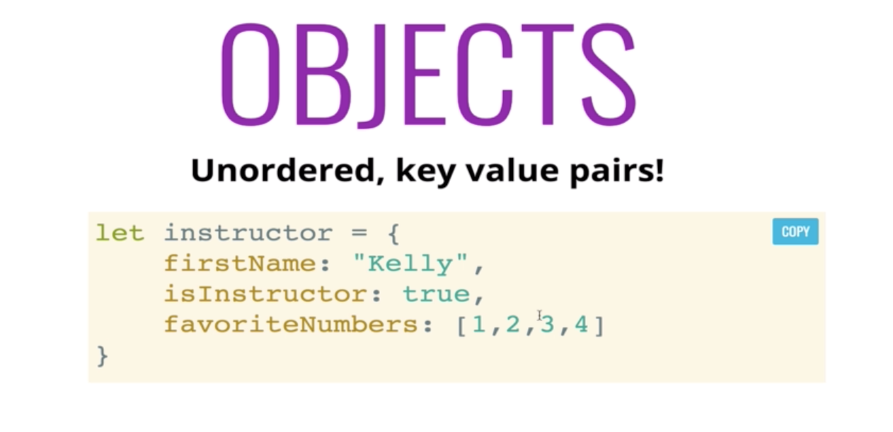
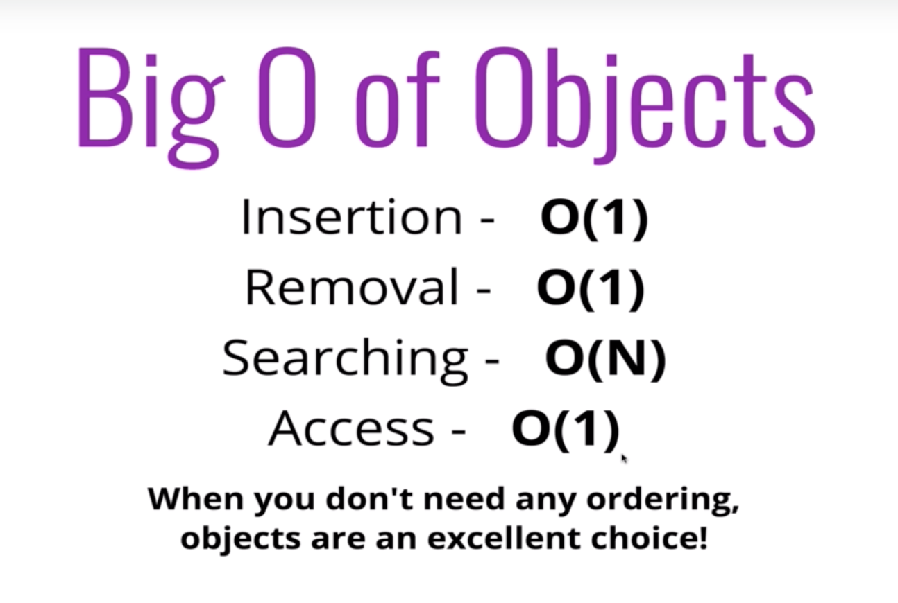
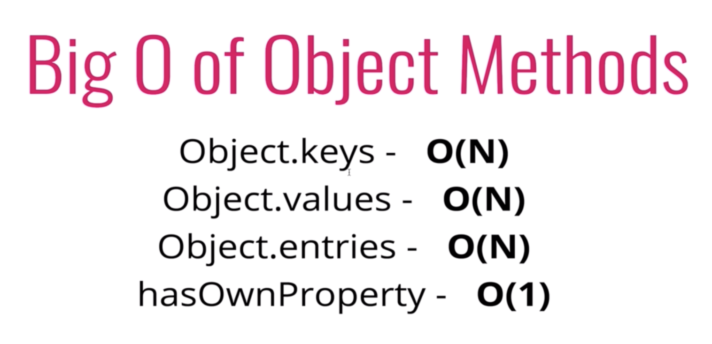
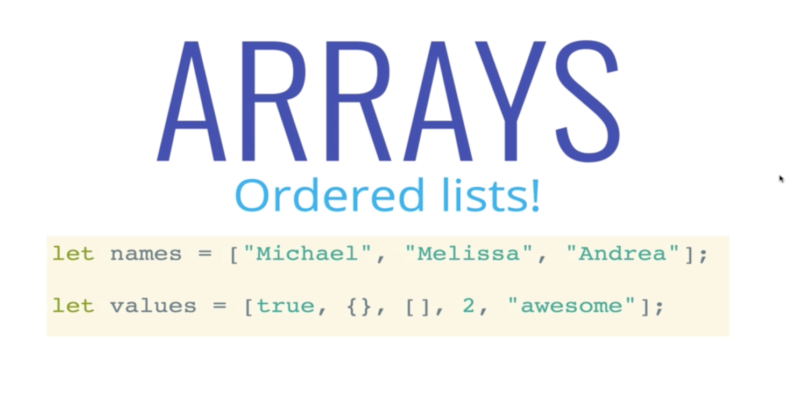
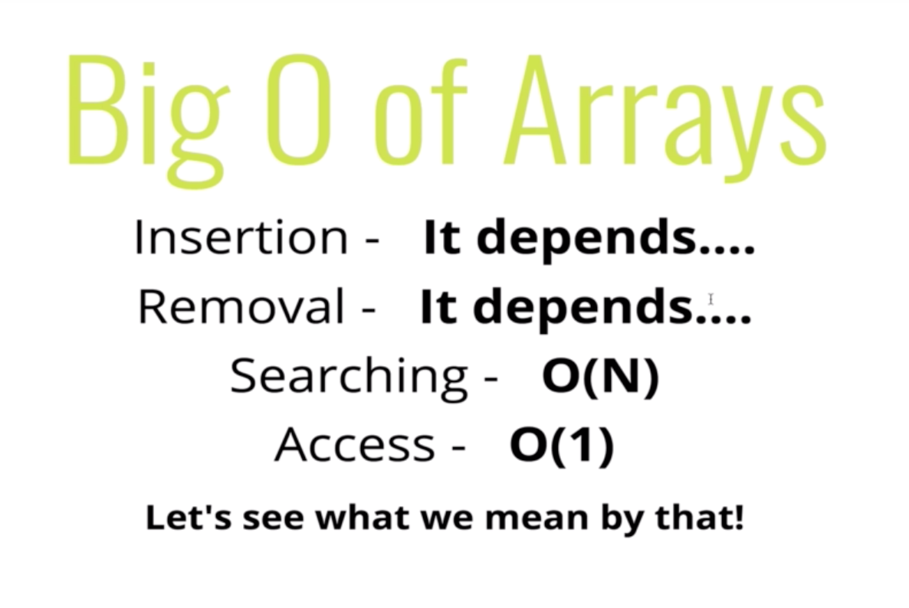
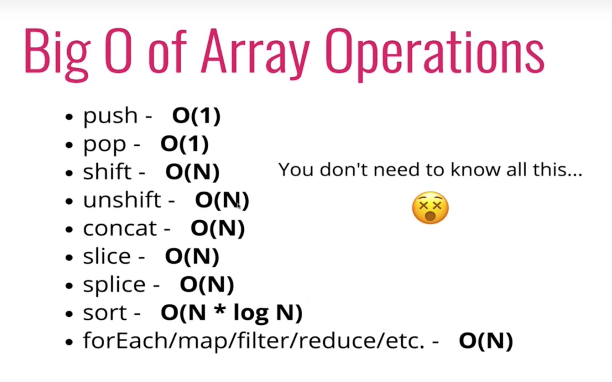

# Analyzing Performance of Arrays and Objects

* Explain why adding elements to the beginning of an array is costly
* Compare and contrast the runtime for arrays, and objects, as well as built-in methods

## Objects

* Non-ordered

* 

* 

* 

  ```javascript
var myHash = {};
myHash['one'] = 1;
myHash['two'] = 2;
for (var key in myHash) {
    if (myHash.hasOwnProperty(key)) {
        //do something
    }
}
```
* The point is to make sure that key is a property defined directly on myHash and not one that was inherited through a prototype chain. Using in doesn't automatically filter out inherited properties, so you get to do it yourself.

## Arrays

* Ordered

* 

* 
  * Insertion and Removal will mess around with the array indices, that is why it depends (re-indexation)
  * If we are **inserting at the beginning** of the array, we are talking about `O(n)` time
    * We will need to something at least once to every single element
  * If we are **removing from the beginning** it is also `O(n)` since we need to re-index every single entry
  * Removing or inserting at the beginning is a cost-full action
  * `push` and `pop` is always fast then `shift` and `unshift`
    * `shift()`: Remove an item from the beginning of an array
    * `unshift()`: Add items to the beginning of an array

* 
  * `slice()` method returns a shallow copy of a portion of an array into a new array from `beginning` to `end`
  * `splice()` method adds/removes items to/from an array, and returns the removed item(s).
