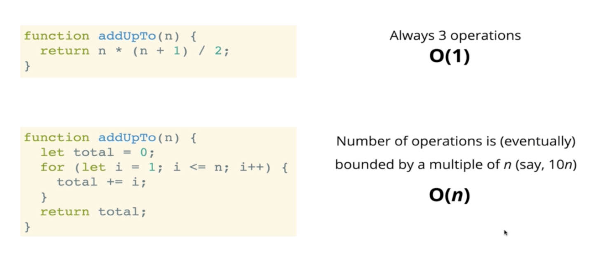
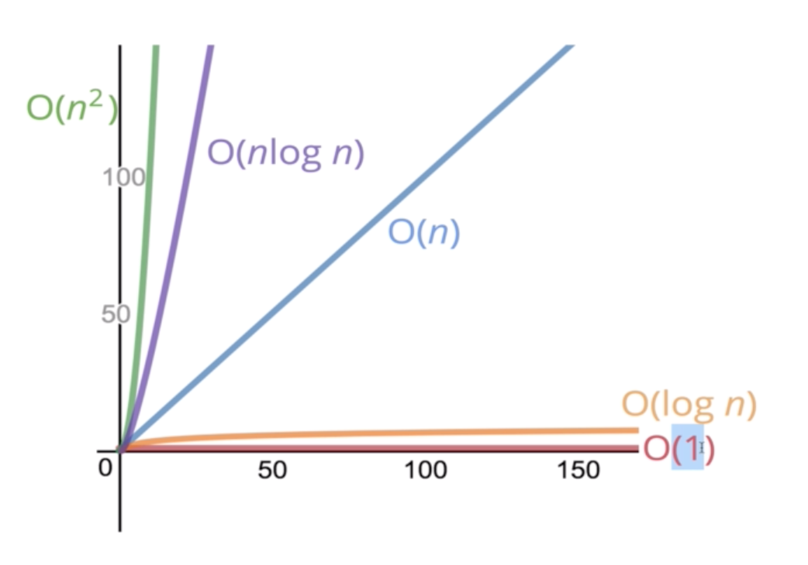

# JavaScript Algorithms and Data Structures

## Big O notation

## Time complexity

* It allows us to talk formally about how the runtime of an algorithm grows as the input grows

* Count **number of operations** the computer needs to perform

  ```javascript
  function addUpTo(n) {
    return n * (n + 1) / 2;
  }
  ```
* No matter the value of `n`, we always execute 3 operations:
  * The multiplication is an operation
  * The addition is an operation
  * The division is an operation

  ```javascript
  function addUpTo(n) {
    let total = 0;
    for (let i = 0; i <= n; i++) {
      total += i;
    }
    return total;
  }
  ```
  * We have one assignment for `total` on the beginning, and one for `i` in the loop setup.
  * If `n` is 5, we have 5 operations for anything inside the loop
    * 5 comparisons `i <= 5`
    * 5 additions and 5 assignments inside the loop for `total`
    * 5 additions and 5 assignments for `i`
  * The number of total operations is `5n + 2`
  * But regardless of the exact number, the number of operations grows roughly proportionally with `n`

* Scale between function and runtime
  * Constant: `f(n) = 1`
  * Linear: `f(n) = n`
  * Quadratic: `f(n) = n^2`
  * etc...
* Big O is the upper bound in terms of runtime, that is the worst case scenario.

* [Demo functions](https://rithmschool.github.io/function-timer-demo/)

* 

* 

* 
* 
  *  `O(100^2 + (100*5) + 8)` = `O(10000 + 500 + 8)`
  * We can ignore `5n` and `8`
* 

* 

## Space complexity

* 

* 

* 

* 

* 

## Logarithms

* 

*   

*   

*   
