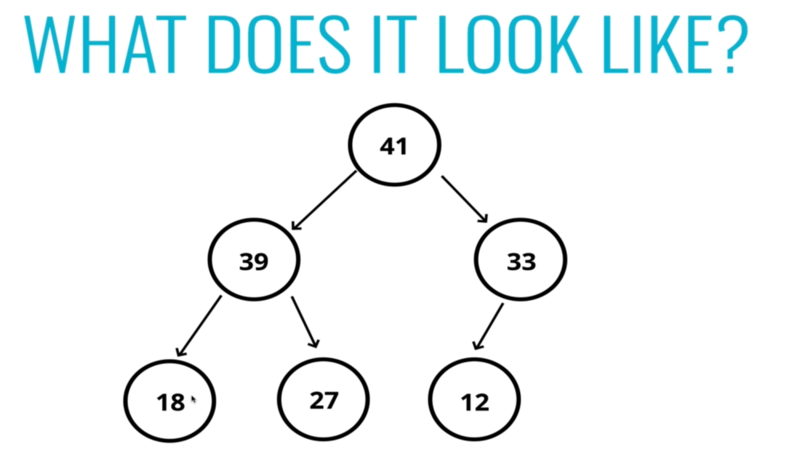
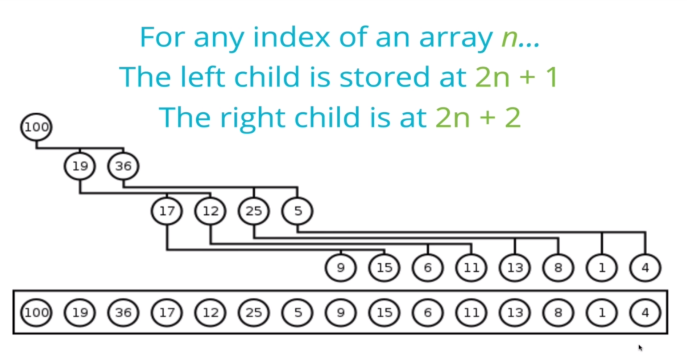
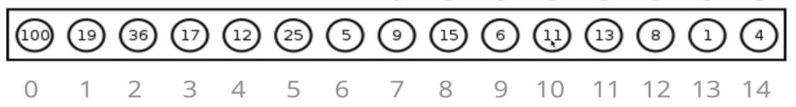
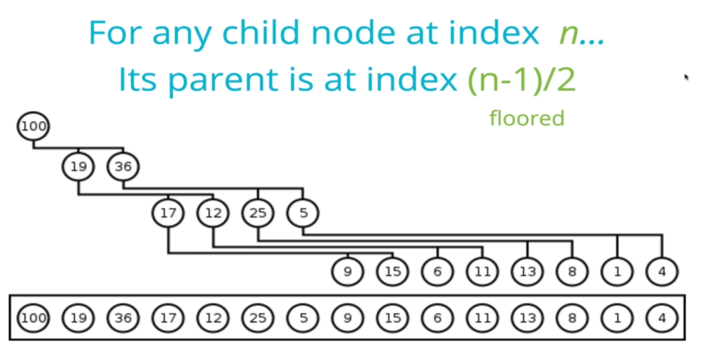
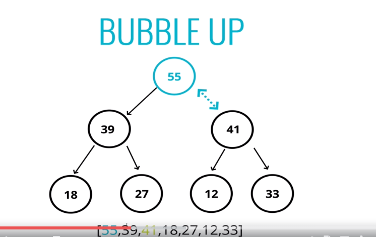
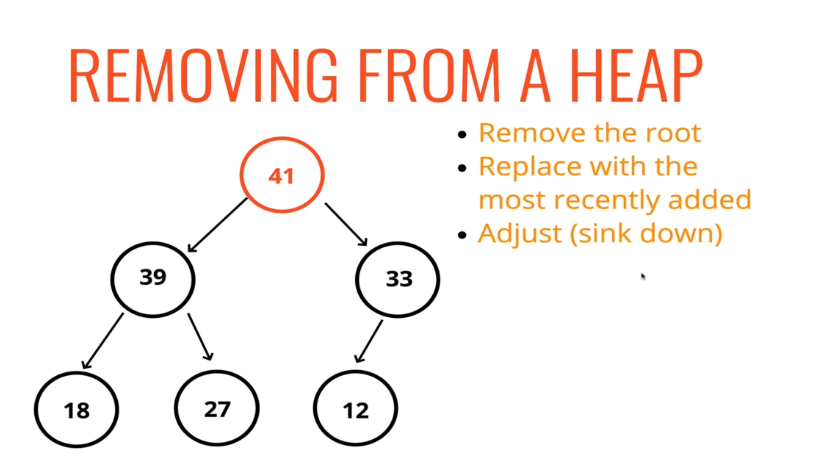
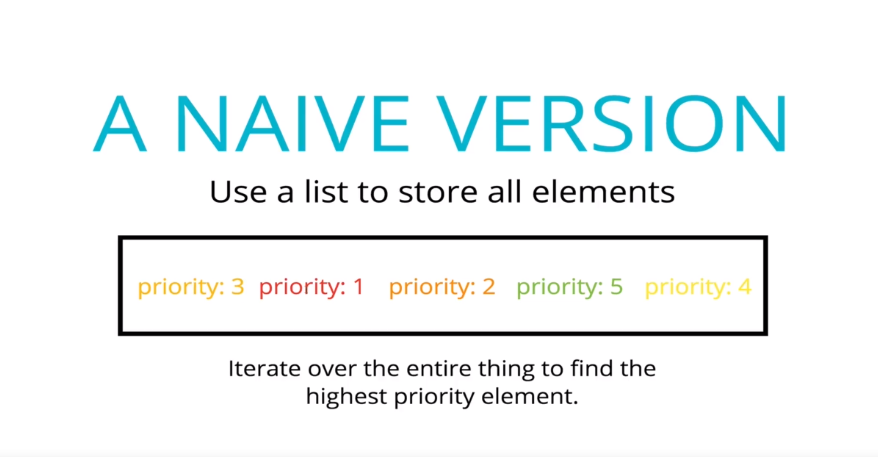
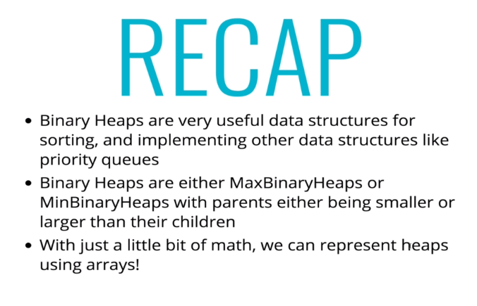

# Heap (data-structure)

In computer science, a **heap** is a specialized tree-based 
data structure that satisfies the heap property described
below.

In a *min heap*, if `P` is a parent node of `C`, then the
key (the value) of `P` is less than or equal to the
key of `C`.

In a *max heap*, the key of `P` is greater than or equal
to the key of `C`

The node at the "top" of the heap with no parents is 
called the root node.

## References

- [Wikipedia](https://en.wikipedia.org/wiki/Heap_(data_structure))
- [YouTube](https://www.youtube.com/watch?v=t0Cq6tVNRBA&index=5&t=0s&list=PLLXdhg_r2hKA7DPDsunoDZ-Z769jWn4R8)

# Binary Heaps

* Min Heap
    * The parent always smaller than the children
    * No right/left child rule like a BST

* Max Binary Heap
    * The parent are always larger than the children
    * No right/left child rule like a BST
    * 
    * Each parent has at most two nodes
    * The binary head always takes the least amount of space. All the children of each node are as full as they can be and **left children are filled out first** (different from a BST, which can end up with a list like structure depending on the values)

* Binary Heaps are used to implement **Priority Queues**, which are very commonly used data structures.
* They are also used quite a bit, with **graph traversal algorithms**

* 
* 
    * `100` on index `0`
    * `19` on index `1`

* 

* 

* Whenever we remove from a Max Binary Heap we remove the root (the highest value). On that note, it means 
removing the min value for the Min Binary Heap.

* 
    * bubble down
    * Extract the first entry from the array and push the last entry to the first position

* Priority Queue

    * A data structure where each element has a priority. Elements with higher priorities are served before elements with lower priorities.

* 

* Big O

    * Insertion - `O(log N)`
    * Removal - `O(log N)`
    * Search - `O(N)`

* 