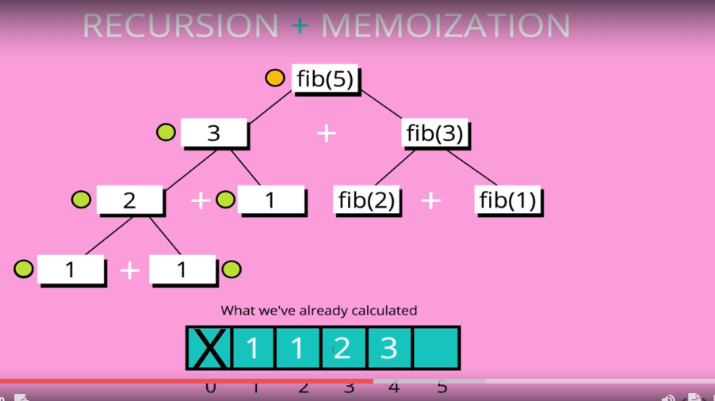

# Dynamic Programming

* A method for solving a complex problem by breaking it down into a collection of simpler sub problems, solving each of those sub problems just once, and storing their solutions.

* We can only use it if we have
    * Optimal substructure 
        * A problem is said to have **optimal substructure** if an optimal solution can be constructed from optimal solutions of its subproblems.
            * Fibonacci 
                * Exponential `(2^n)`
                * 
            * 
            * 
                * Subproblems wont help us find optimal solution for our problem
    * Overlapping subproblems
        * A problem is said to have **overlapping subproblems** if it can be broken down into subproblems which are reused several times

* 
    * Repetition of sub problems (overlapping)
    * 

* Memoization (Lets store our solutions)
    * Storing the results of expensive function calls and returning the cached result when the same input occurs again
    * 

    * Big O
        * It grows more in line with `O(n)`
        * 
        * 

* Tabulation
    * We are doing top-down, but we can also do it bottom-up
    * Storing the result of a previous result in a "table" (usually an array)
    * Usually done using **iteration**
    * Better **space complexity** can be achieved using tabulation
        * 
        * A recursive approach can end up in a stack overflow 
        * The iterative version won't face this issue