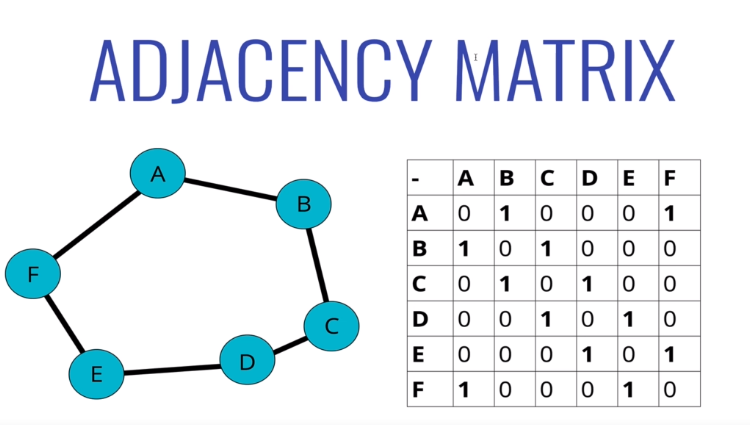
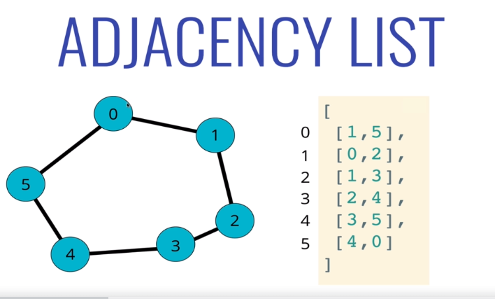
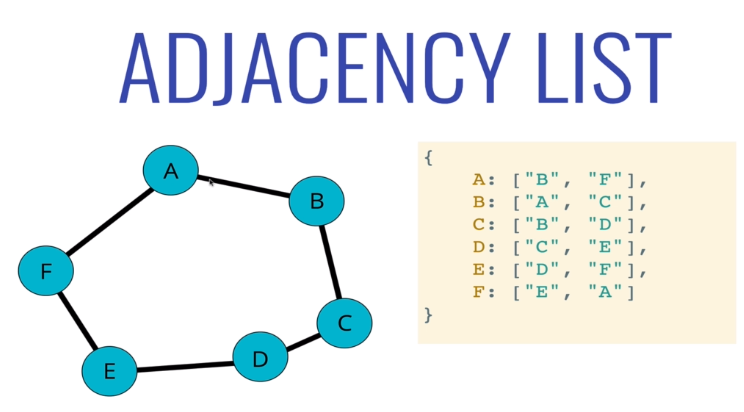
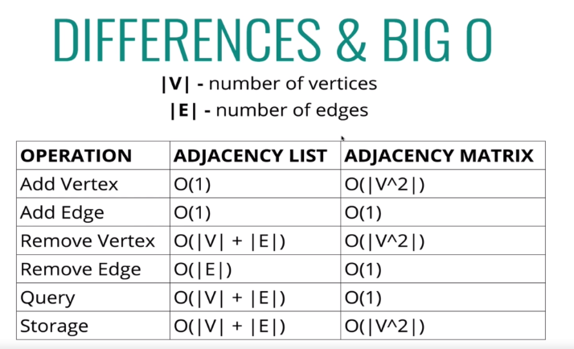
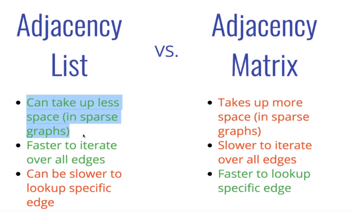
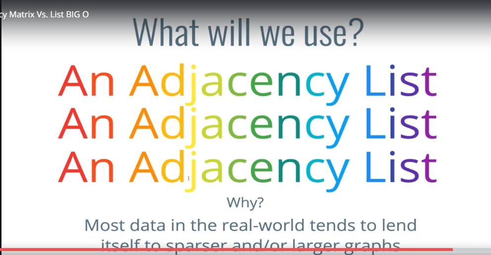

# Graph

* Vertex (circle / node)
* Connections are Edges 
    * You can put weights on the edges

* Adjacency Matrix
    * 

* Adjacency List
    *  
    *  

*  
    *  

*  

## Graph Traversal 

* Visiting, updating, checking each vertex in graph

