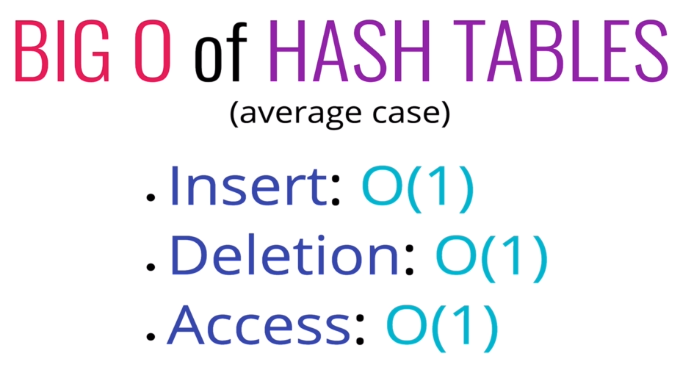
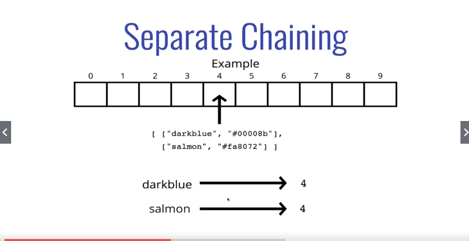
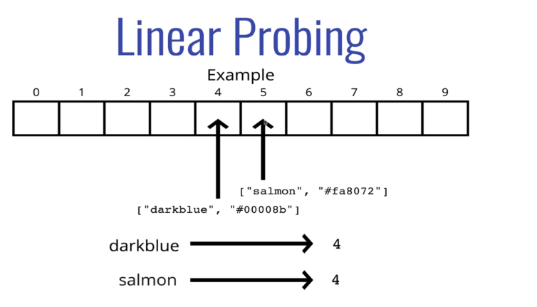

# Hash Table

* Hash function
    * Fast (constant time)
    * Doesn't cluster outputs at specific indices, but distributes uniformly 
    * Deterministic (same input for an output)

* 
    * How good is your hash function (constant time)
    * Spread out as possible
    * Separate chaining and linear probing

* Using modulo to keep the values in the array length range
* The prime number in the hash is helpful in spreading out the keys more uniformly. 
    * Prime numbers decreases the number of collisions 
    * It is also helpful if the array that you are putting values into has a prime length

* **Separate Chaining**
    * With separate chaining, at each index in our array we store values using a more sophisticated data structure (e.g. an array or a linked list)
    * 

* **Linear Probing**
    * With linear probing, when we find a collision, we search through the array to find the next empty slot.
    * 