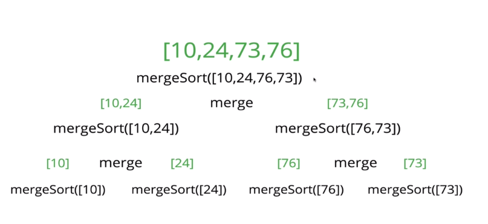
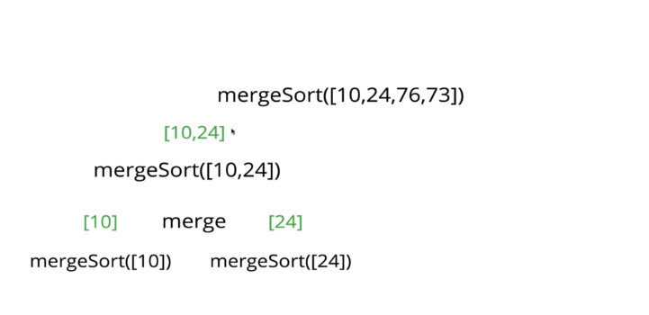
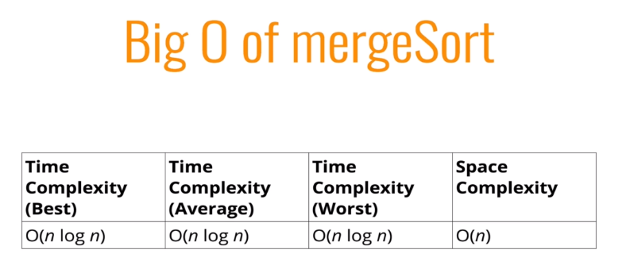

# Merge Sort

* It is a combination of splitting up, merging and sorting
* Divide and conquer approach
* Exploits the fact that arrays of 0 or 1 element are always sorted
    * 
    *  
    *  

*  `log2 4 = 2` or `log2 8 = 3` --> that is how tall the tree is
* `n` comes from the merge part `O(n+m)`
* For a data agnostic algorithm, the best we can do is `O(n log n)`