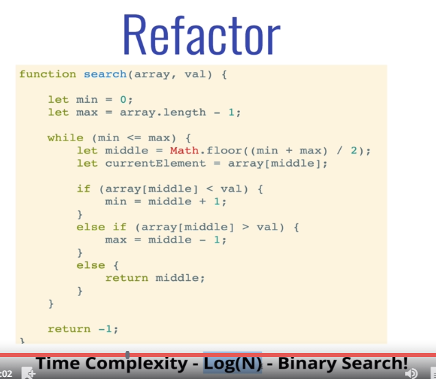

# Problem Solving Patterns

## Frequency Counters

* This pattern uses objects or sets to collect values / frequencies of values
    * This can often avoid the need for nested loops or O(N^2) operations with arrays / strings
    * `problems/1 - sameSquared`
    * `problems/2 - anagrams`

## Multiple pointers

* Creating **pointers** or values that correspond to an index or position and move towards the beginning, end or middle based on a certain condition

    * Very efficient for solving problems with minimal space complexity as well
    * `problems/3 - sumZero`
    * `problems/4 - countUniqueValues`

## Sliding Window

* This pattern involves creating a window which can either be an array or number from one position to another.
* Depending on a certain condition, the window either increases or closes (and a new window is created)
* Very useful for keeping track of a subset of data in an array/string etc.
    * `problems/5 - maxArraySum`

## Divide and Conquer

* This pattern involves dividing a data set into smaller chunks and the repeating a process 
with a subset of data.

* This pattern can tremendously **decrease time complexity**
    * 