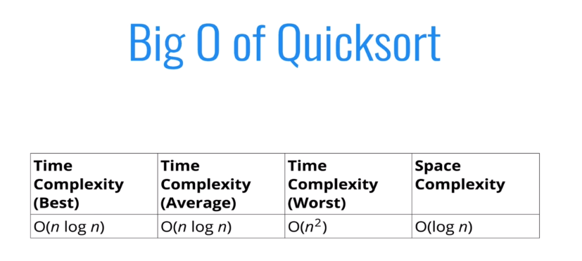

# Quick Sort

* Like merge sort, exploits the fact that arrays of 0 or 1 element are always sorted
* Works by selecting one element (called the "pivot") and finding the index where the pivot should end up in the sorted array
* Once the pivot is positioned appropriately, quick sort can be applied on either side of the pivot

* 
    * Best case with `O(log n)` decompositions (size of tree)
        * Splitting on half all the time (just like merge sort)
        * Worst case is a sorted array (generating n pivots / n decompositions). Pivot is minimum element or maximum element.
            * Try pivoting by the mid element