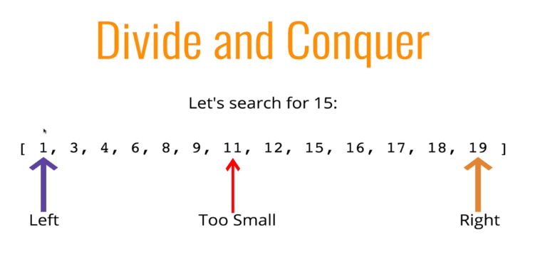

# Search Algorithms

* Linear search
    * Basically a for loop checking every single option
    * Works great for non-sorted data
        * `indexOf`
        * `includes`
        * `find`
        * `findIndex`

* Binary Search
    * Much faster form of search
    * Rather than eliminating one element at a time, you c an eliminate half of the remaining elements at a time.
    * Binary search only works on sorted arrays!
    * Divide and conquer
    * How it works?
        * This function accepts a sorted array and a value
        * Create a left pointer at the start of the array, and a right pointer at the end of the array
        * While the left pointer comes before the right pointer
            * 
            * Create a pointer in the middle
            * If you find the value you want, return the index
            * If the value is too small, move the left pointer up
            * If the value is too large, move the right pointer down
        * If you never find the value, return -1

* Naive String Search
    * Suppose you want to count the number of times a smaller string appears in a longer string
    * A straightforward approach involved checking pairs of characters individually

* KMP method
    * TODO