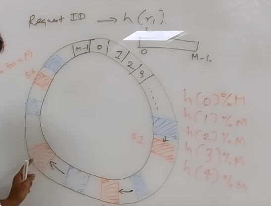

# System Design 

* Examples
    * [Uber System Design](https://www.youtube.com/watch?v=umWABit-wbk&t=20s)
    * [Consistent Hashing](https://www.youtube.com/watch?v=zaRkONvyGr8)

## Finite State Machine

* A finite-state machine (FSM) or finite-state automaton (FSA, plural: automata), finite automaton, or simply a state machine, is a mathematical model of computation. It is an abstract machine that can be in exactly one of a finite number of states at any given time. The FSM can change from one state to another in response to some external inputs; the change from one state to another is called a transition. An FSM is defined by a list of its states, its initial state, and the conditions for each transition. Finite state machines are of two types – deterministic finite state machines and non-deterministic finite state machines.[1] A deterministic finite-state machine can be constructed equivalent to any non-deterministic one.

* The behavior of state machines can be observed in many devices in modern society that perform a predetermined sequence of actions depending on a sequence of events with which they are presented. Simple examples are vending machines, which dispense products when the proper combination of coins is deposited, elevators, whose sequence of stops is determined by the floors requested by riders, traffic lights, which change sequence when cars are waiting, and combination locks, which require the input of combination numbers in the proper order.

## Web Application Firewall

* A web application firewall (or WAF) filters, monitors, and blocks HTTP traffic to and from a web application. A WAF is differentiated from a regular firewall in that a WAF is able to filter the content of specific web applications while regular firewalls serve as a safety gate between servers. By inspecting HTTP traffic, it can prevent attacks stemming from web application security flaws, such as SQL injection, cross-site scripting (XSS), file inclusion, and security misconfigurations.

## Load balancing 

* At Layer 4, a load balancer has visibility on network information such as application ports and protocol (TCP/UDP). The load balancer delivers traffic by combining this limited network information with a load balancing algorithm such as round-robin and by calculating the best destination server based on **least connections** or **server response times**.

* At Layer 7, a load balancer has application awareness and can use this additional application information to make more complex and informed load balancing decisions. With a protocol such as HTTP, a load balancer can uniquely identify client sessions based on cookies and use this information to deliver all a clients requests to the same server. This server persistence using cookies can be based on the server’s cookie or by active cookie injection where a load balancer cookie is inserted into the connection. Free LoadMaster includes cookie injection as one of many methods of ensuring session persistence.

* 

## Pub Sub

* In software architecture, publish–subscribe is a messaging pattern where senders of messages, called publishers, do not program the messages to be sent directly to specific receivers, called subscribers, but instead categorize published messages into classes without knowledge of which subscribers, if any, there may be. Similarly, subscribers express interest in one or more classes and only receive messages that are of interest, without knowledge of which publishers, if any, there are.

* Publish–subscribe is a sibling of the message queue paradigm, and is typically one part of a larger message-oriented middleware system. Most messaging systems support both the pub/sub and message queue models in their API, e.g. Java Message Service (JMS).

    * The Java Message Service (JMS) API is a Java message-oriented middleware API for sending messages between two or more clients.[1] It is an implementation to handle the producer–consumer problem. JMS is a part of the Java Platform, Enterprise Edition (Java EE)

* This pattern provides greater network scalability and a more dynamic network topology, with a resulting decreased flexibility to modify the publisher and the structure of the published data.

* Examples
    * SNS and Kafka

## Consistent Hashing

* What is a Hash Table: https://www.hackerearth.com/practice/data-structures/hash-tables/basics-of-hash-tables/tutorial/

* First off we will allocate an array `From 0 to M`

* We will hash all incoming requests: `hash(r1) % M`
    * We will hash our servers as well: `hash(serverId) % M`

* We will match our `request` with the nearest `server` position from left to right (clock-wise ring)

    * 
        * Requests marked in blue
        * Servers marked in red

* Uniform hash, uniform load
    * Load average of 1 by N
    * Easy load balancing 

* Each server should have multiple hash functions, that way we can handle situations where our servers go down.
    * Having more hashes will help us balance income requests better as well. We are minimizing the GAP in our array. We are minimizing the chance the load will be delivered to a single server

## Remote Procedure call (RPC)

Remote Procedure Call (RPC) is a powerful technique for constructing distributed, client-server based applications. It is based on extending the conventional local procedure calling, so that the called procedure need not exist in the same address space as the calling procedure. The two processes may be on the same system, or they may be on different systems with a network connecting them.

* 

* 

