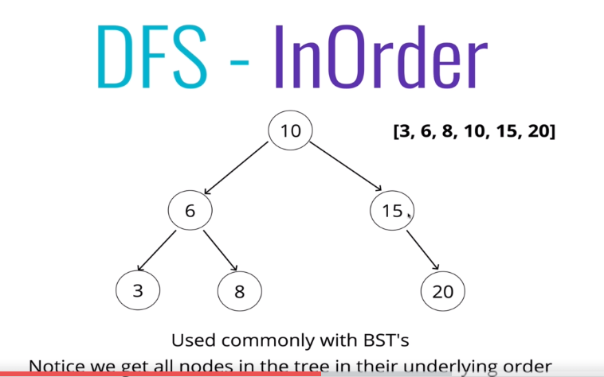

# Tree Traversal

* Breath First Search 
    * Working on every level before going deep (horizontally)
    * Every sibling node before a child
    * 

* Deep first search
    * Going down to the end of the tree (vertically)
    * In order (down -> up for each side)
    * Pre Order (up -> down for each side)
    * Post Order (down -> up for both sides)

* While executing, be careful with the size of the BFS queue. If the tree has many branches, that may implicate in your space complexity

* On wider trees, depth first will use less space
* On deeper trees, we will use more of the call stack on DFS algorithms
    * 